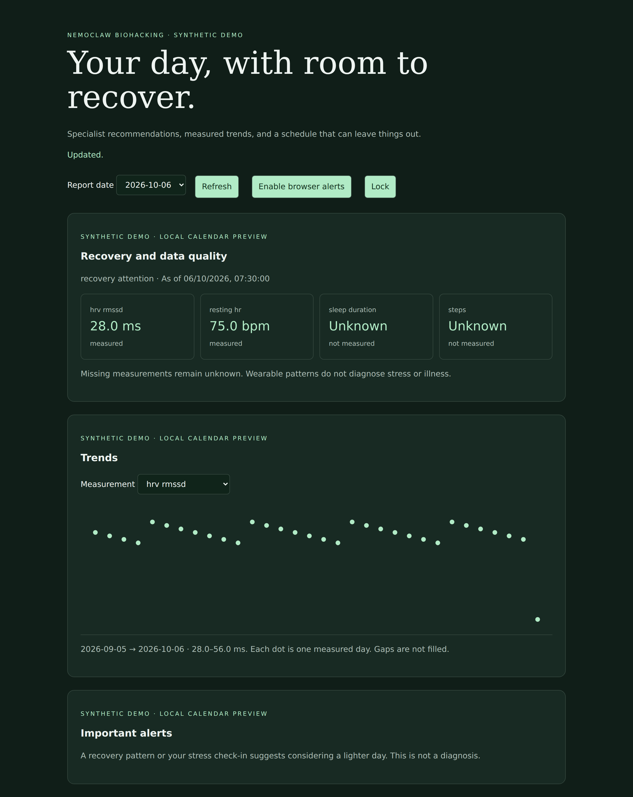

# NemoClaw Biohacking

**15 specialist agents. Measured context. Bounded autonomous actions.**

A personal AI project for daily wellbeing, learning, creative practice, and movement, designed around **NemoClaw, OpenClaw, and OpenShell**. It combines specialized reasoning with deterministic health-data processing and controlled calendar actions.

**Status: under active development and testing.** This is the public showcase. The implementation, full prompts, and deployment configuration are maintained privately. This repository contains documentation and synthetic demo screenshots; it is not an installable application.

[Architecture](docs/architecture.md) · [Security](docs/security.md) · [Data quality](docs/data-quality.md) · [Validation](docs/validation.md) · [Screenshots](docs/screenshots.md)

## The problem

The original n8n project accumulated substantial orchestration overhead. This redesign uses its useful behavior as a requirements source and assigns responsibilities to the primitives that fit them: agents for specialized interpretation, skills for reusable procedures, native automation for scheduling, MCP for controlled tools, OpenShell for runtime boundaries, and deterministic code for exact calculations and actions.

The goal is a maintainable personal system that can recommend useful activities while respecting missing data, uncertainty, available time, and explicit permissions.

## What the project does

- Keeps all 15 specialists individually defined while routing daily work to a selected subset.
- Separates raw observations, numerical processing, uncertainty, agent interpretation, and action authorization.
- Preserves missing and invalid measurements instead of replacing them with healthy-looking defaults.
- Supports optional recommendations, skipped work, deferred tasks, and bounded calendar scheduling.
- Keeps recommendations and outcomes in structured state, with a private dashboard for longer reports and history.
- Places external actions behind a trusted broker rather than granting general API access to every specialist.

## Dashboard preview

*Actual dashboard captured with synthetic data and a local calendar preview adapter. The demonstration uses fabricated specialist proposals and does not call an LLM. [View all five screenshots and their scope.](docs/screenshots.md)*

## The 15 specialists

| Specialist            | Responsibility                                 |
| --------------------- | ---------------------------------------------- |
| `sleep_guardian`      | Sleep habits, recovery routines, and wind-down |
| `metabolic_advisor`   | Nutrition and everyday energy habits           |
| `skin_advisor`        | Skin-care routines and comfort                 |
| `circadian_optimizer` | Daily timing and routine consistency           |
| `creative_flow`       | Creative practice and expression               |
| `peak_cognition`      | Focus, learning, and study routines            |
| `body_architect`      | Strength habits and physical goals             |
| `inner_compass`       | Self-reported stress awareness and grounding   |
| `pianistics`          | Piano, harmony, rhythm, and technique          |
| `rhythm_body`         | Dance, rhythm, and coordination                |
| `voice_coach`         | Comfortable vocal practice and expression      |
| `guitar_path`         | Guitar, songs, and fretboard practice          |
| `social_intelligence` | Communication and relationship reflection      |
| `aesthetic_optimizer` | Grooming, style, and presentation              |
| `kinetic_optimizer`   | Mobility and aerobic movement habits           |

Specialists have separate responsibilities and scoped context. The reference design shares an OpenClaw runtime and an outer OpenShell sandbox; it does **not** claim fifteen separate operating-system security domains.

## How responsibilities are divided

| Component           | Responsibility                                                                       |
| ------------------- | ------------------------------------------------------------------------------------ |
| NemoClaw / OpenClaw | Agent runtime, specialist coordination, skills, conversation, and daily automation   |
| OpenShell           | Declared filesystem, network, and credential boundaries around the reasoning runtime |
| MCP tools           | Narrow requests between the coordinator and the trusted broker                       |
| Python broker       | Validation, numerical processing, authoritative state, and action decisions          |
| SQLite              | Observations, proposals, task state, and recorded outcomes                           |
| Calendar adapter    | Preview planning and a separately configured Google Calendar integration             |
| Private dashboard   | Trends, recommendations, alerts, task outcomes, and check-ins                        |

The [architecture document](docs/architecture.md) explains communication and trust boundaries. Platform enforcement must be verified on the deployed runtime; generating configuration alone does not prove isolation.

## Current evidence

| Area                                    | Recorded status                                                                                        |
| --------------------------------------- | ------------------------------------------------------------------------------------------------------ |
| Reference implementation tests          | **52 passed**, re-run on 2026-10-06; two dependency deprecation warnings                               |
| Local dashboard                         | Five desktop/mobile browser captures with synthetic data; no JavaScript errors observed during capture |
| Calendar logic                          | Local preview and mocked integration tests; live Google account acceptance remains pending             |
| Native agents and OpenShell enforcement | Configuration exists in the private implementation; target-machine acceptance remains pending          |
| Real wearable ingestion                 | Device acceptance remains pending                                                                      |
| Model quality and performance           | No benchmark or live model-quality result claimed                                                      |

See [validation scope and remaining work](docs/validation.md) and the [structured validation summary](evidence/validation-summary.json). The test suite itself is private; these results are a recorded local run, not a public CI badge or an independent audit.

## Health and privacy scope

This is a personal software prototype. Recovery signals are application heuristics, not medical diagnoses. Consumer measurements, self-reported stress, and an agent's interpretation remain distinct. Screenshots contain synthetic data only.

The public materials explain the design and demonstrate the interface. Source code, complete prompts, secrets, real measurements, conversation history, and deployment settings are outside this repository.

## 
