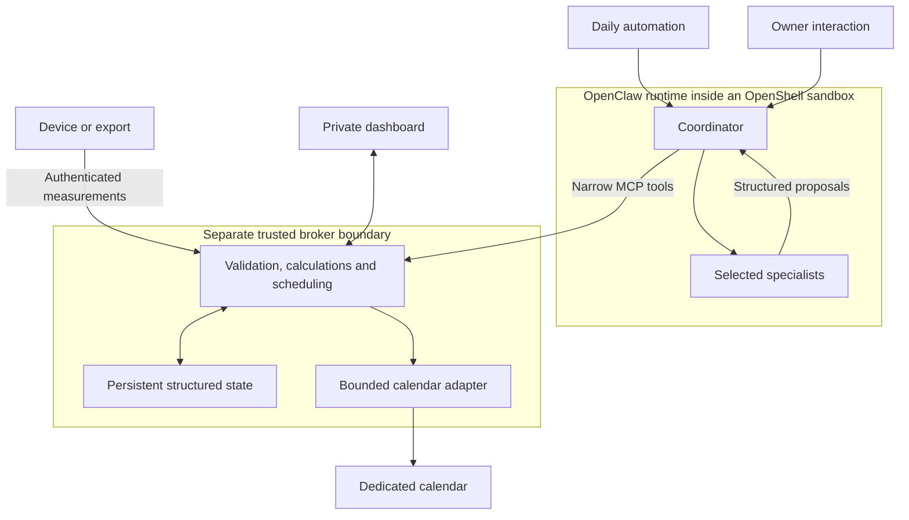

# Architecture

[Back to the project overview](../README.md)

This document describes the private reference implementation at a public design level. It intentionally omits executable configuration, exact deployment endpoints, full prompts, and numerical tuning parameters. Local broker behavior has been exercised; native runtime acceptance is a separate validation step.

## Communication and authority

The reasoning tier proposes activities. The broker determines whether a proposal can become an action. Observation records and action state are authoritative; an agent's narrative does not overwrite them.

## Why these primitives

| Responsibility | Chosen primitive | Practical reason |
| --- | --- | --- |
| Specialized interpretation | Distinct OpenClaw agents | Preserves domain expertise, responsibilities, and scoped context |
| Reusable procedures | Skills | Keeps shared guidance consistent across specialists |
| Daily initiation | Native automation | Avoids maintaining a separate workflow engine for the trigger |
| Coordination | Native agent sessions | Supports selected specialists and bounded parallel execution |
| Controlled requests | MCP tools | Gives the coordinator a small, structured interface to the broker |
| Runtime access limits | OpenShell policies | Moves filesystem, network, and credential restrictions outside model reasoning |
| Exact behavior | Deterministic Python functions | Makes validation, timestamps, IDs, aggregation, and state transitions testable |
| Durable records | SQLite | Keeps observation, recommendation, and outcome history transactional |
| Long-form output | Dashboard and structured reports | Separates conversation from persistent records |

## A daily cycle

1. A native automation asks the coordinator to begin a date-specific cycle.
2. The broker prepares validated observations, computed summaries, and a selection of due specialists.
3. Specialists receive relevant context and return proposals, including skip or defer decisions when appropriate.
4. The coordinator submits those proposals through bounded tools.
5. The broker checks the proposal contract and refreshes relevant recovery, check-in, and availability information before planning.
6. Eligible activities enter a preview or an authorized external-action path. Unsuitable work can remain deferred, blocked, or absent.
7. The dashboard reads stored recommendations and task state. Owner feedback is recorded separately from agent proposals.

A repeated daily request reuses the existing cycle. Partial results remain visible instead of inventing responses for missing specialists. Maintenance and retry processing do not need additional model calls.

## Separation that matters

**Agent roles:** specialists have separate roles, workspaces, and session context in one shared runtime. These are logical boundaries. Hostile-tenant isolation between specialists is not claimed.

**Action authority:** the broker is a separate trust boundary. It owns integration credentials, schema enforcement, numerical processing, and permitted state changes. A claimed specialist name in a proposal is attribution, not independent proof of authorship.

**Data and inference:** relevant context can reach the configured inference provider. Keeping calendar credentials in the broker does not mean that all health context stays on the local device.

**Stored outcomes:** a suggestion, a planned task, a confirmed external event, and a user-reported completion are different records or states. The model does not certify that an activity happened.

## What changed from the workflow implementation

The redesign preserves specialist identities, useful guidance, biometric context, and daily planning. It replaces node-by-node orchestration with explicit domain components. Integrations are shared behind tools, calculations operate on structured records, and the system can leave work out of the day.

The expected benefit is lower maintenance overhead and fewer unnecessary model calls. No measured latency, cost, or throughput improvement is claimed yet.

## Platform references

- [NVIDIA DLI course](https://nvdli.github.io/NemoClawDLI/nemoclaw/index.html)
- [OpenClaw multi-agent documentation](https://docs.openclaw.ai/concepts/multi-agent)
- [NVIDIA OpenShell](https://github.com/NVIDIA/OpenShell)

These references explain platform concepts. They do not certify this project's deployment or establish compatibility with every platform version.
