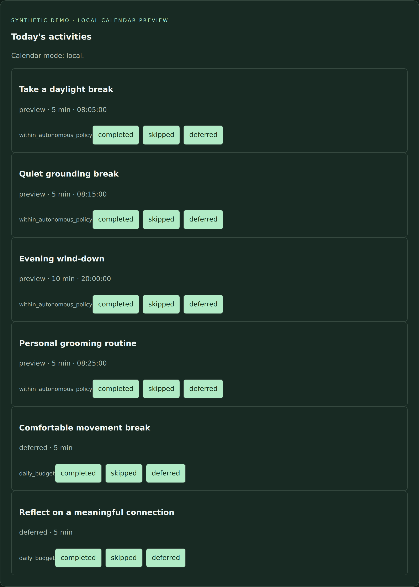
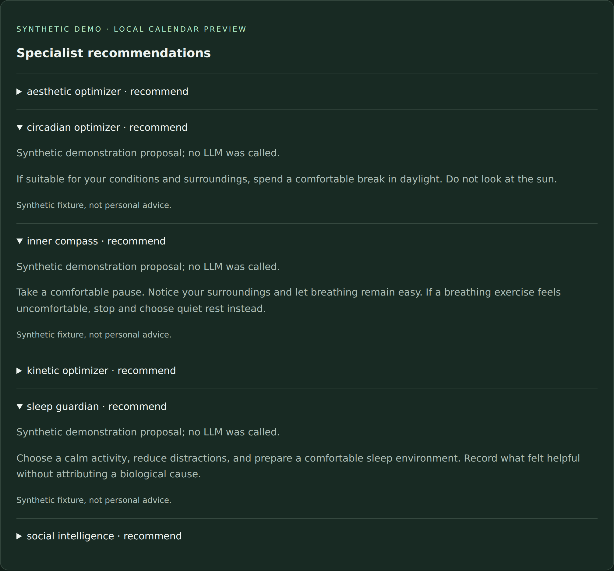
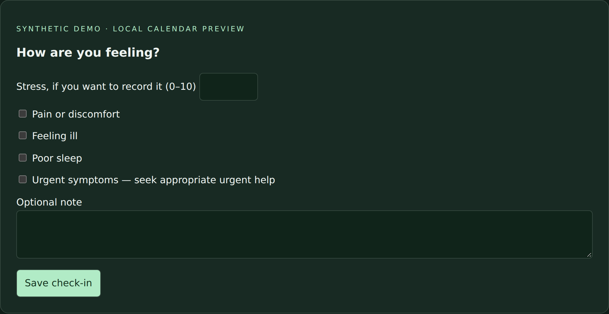
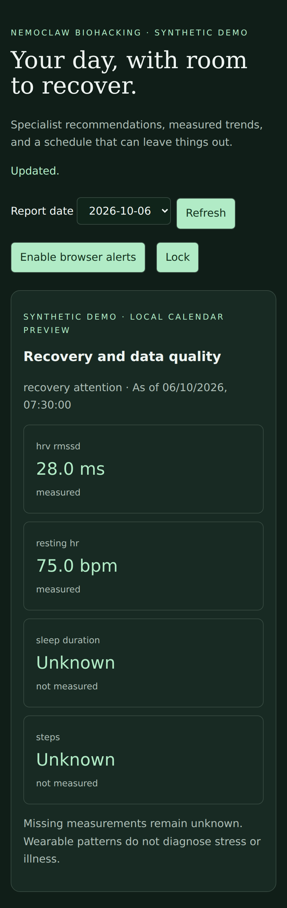

# Screenshot gallery

[Back to the project overview](../README.md)

These are captures of the existing local dashboard with synthetic measurements and fabricated demonstration proposals. **No LLM was called, no wearable was connected, and no external calendar events were created for these images.** They show local interface behavior rather than a live native-agent deployment.

Every image carries a synthetic-demo label added during capture. The demonstration date is 2026-10-06. Screenshots contain no credentials or real health records.

## Dashboard, trends, and alerts

Measured values and unknown values remain distinct. The alert describes a scheduling heuristic and explicitly avoids a diagnosis.

## Activity planning

The planner can leave activities out of the day. The four previewed tasks have proposed times; two additional activities remain deferred. Preview is not confirmation of a real calendar event.

## Specialist recommendations

Selected specialists keep individual recommendations and uncertainty text. These are fixed demo proposals. Their presence does not measure model quality or show all 15 specialists running simultaneously.

## Optional check-in

The form accepts optional self-reported stress, wellbeing flags, and a note. This screenshot shows the blank form; it does not record a submitted check-in.

## Mobile-sized view

The same interface captured at a mobile-sized browser viewport. This is viewport emulation, not a physical-device test.

For the test scope and remaining acceptance work, see [Validation](validation.md).
